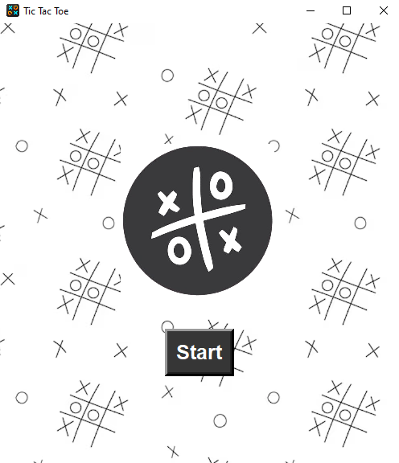
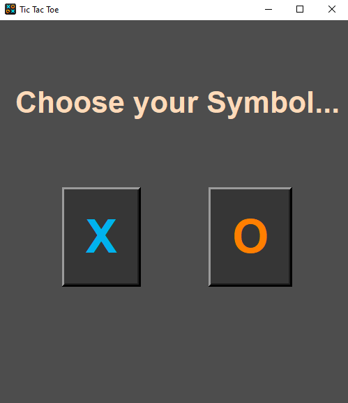
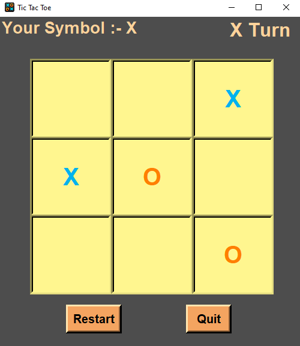

# Tic-Tac-Toe

A classic Tic-Tac-Toe game created with Python and Tkinter. It’s a simple and enjoyable two-player game that brings the timeless experience of Tic-Tac-Toe to your desktop.

# Features

- Intuitive GUI: Built using Tkinter, with a clean and simple interface.
- Player vs. Player Mode: Play locally with a friend on the same device.
- Automatic Win and Draw Detection: The game checks for win conditions and announces the result instantly.
- Restart Option: Easily reset the game to play again without restarting.
- Exit Option: To Exit or Quit the game.

# How to Run

Clone the Repository

```bash
    git clone https://github.com/Mukeshp405/Tic-Tac-Toe.git
```

Go to the Tic-Tac-Toe directory

```bash
    cd Tic-Tac-Toe
```

Run the file

```bash
    python main.py
```

# Requirements

- Python 3.x

Go to this link and download
[Download Python](https://www.python.org/downloads/)

- Tkinter

Install tkinter

```bash
    pip install tkinter
```

# Interface

- Starting page
<p align="center">
    
</p>

- Selection page
<p align="center">
    
</p>

- Playing page
<p align="center">
    
</p>

Enjoy the classic game with a modern Python GUI twist!
